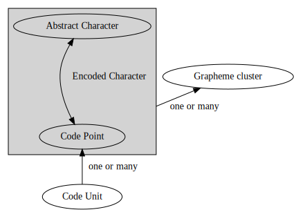

+++
title = "为什么编程语言总是应该使用UTF-8而不是UTF-16"
template = "page.html" 
date = 2018-12-15
[taxonomies]
tags = ["programming"]
+++

[^1]前段时间研究字符编码的时候，看到了一个[知乎问题](https://www.zhihu.com/question/35214880)，
里面的回答基本上都概念不清，事实上，Unicode “字符”、
“字符串”、“编码”等词语涉及到非常复杂的概念。而目前介绍这个主题的中
文文章似乎较为稀少，于是有了这篇文章。

<!-- more -->

我会尽量在保证准性的情况下，
使文章<s>简短</s>，易懂。但我不是字符编码方面的专家，如果有遗漏错误之处，
欢迎在评论区中指出。

# Unicode 编码基本概念

## 编码单元 ([Code Unit](http://www.unicode.org/glossary/#code_unit))
可以表示一段已编码文本的最小比特组合。例如，UTF-8、UTF-16 和 UTF-32 分
别使用 8 比特、16 比特和 32 比特编码单元。比如文本“`💣`”（U+1F4A3）可
以编码成四个 UTF-8 编码单元“`f0 9f 92 a3`”，两个 UTF-16 编码单元“`3dd8
a3dc`”，一个 UTF-32 编码单元“`0001f4a3`”。

## 抽象字符 ([Abstract character](http://www.unicode.org/glossary/#abstract_character))
一个用于组织、控制或表示文字数据的信息单元。例如，英文字母表的第一个大
写字母是一个抽象字符，它可以用“A”或“A”表示，但它不是“a”或“B”。任何人能想到的字符，都
是抽象字符。例如， 精灵语 tengwar 里的字母 ungwe 是一个抽象的字符，虽
然它尚不能用 Unicode 表示。

## 码位 ([Code point](http://www.unicode.org/glossary/#code_point))
Unicode 编码空间的任何数值。例如 U+3243F。

## 已编码字符 ([Encoded character](http://www.unicode.org/glossary/#encoded_character))
码位和抽象字符之间的映射。例如，U+1F428 是一个代表抽象字符 🐨 考拉的已编码字符。

这种映射是既不是双射，也不是单射，更不是满射：

- 代理字符 (surrogate)，非字符 (noncharacter) 和未分配的码位完全不对应抽象字符。
- 一些抽象字符可以由不同的码位进行编码；`U+03A9 希腊大写字母 Omega` 和 `U+2126 欧姆符号` 都对应于同一个抽象字符“Ω”，必须同等对待。
- 一些抽象字符无法用单个码位进行编码，要用已编码字符的序列才能表示它们。
  例如，表示抽象字符 ю́ 带锐音符的西里尔小写字母 yu 的唯一方法是使用 `U+044E 西里尔小写字母 yu` 和 `U+0301 组合锐音符` 这个序列。

此外，一些抽象字符不仅有单码位表示方法，还有多码位表示方法。抽象字符 ǵ
可以用单一码位 `U+01F5 带锐音符的拉丁小写字母 g` 编码，或者用 <`U+0067 拉
丁小写字母 g`, `U+0301 组合锐音符`> 这个序列。

## 字素群 ([Grapheme cluster](http://www.unicode.org/glossary/#grapheme_cluster))
“应该放在一起”的已编码的字符序列。例如它们可适用于光标移动和选择。

此外还有[用户观感字符 (User-perceived character)](http://www.unicode.org/glossary/#user_perceived_character)与[字模 (Glyph)](http://www.unicode.org/glossary/#glyph)。但与日常编程关系不大。

# 编程语言中的实现
## 字符
上节提到的概念都能用“字符”表示。所以不同的编程语言对此的处理不尽相同，
例如，C#当中的`char`类型表示一个 UTF-16 **编码单元**，而 Rust 的 `char` 类型则表示一个 **Unicode 标量**
（Unicode Scalar Value，代理字符以外的所有码位）。C/C++ 中的 `char` 类型
甚至只表示一个固定长度的整型数据。Go 中的字符表示一个
**码位**，为了突出这一性质，它甚至起了一个专门的名字 `rune` 来表示字符。
但是在上述各种实现中，只有使用 **码位** （以及衍生的 **标量**）的方案
才能使 `char` 类型不至于存放损坏的 Unicode 数据。

## 字符串
字符串的编码一般采用 UTF-8 或 UTF-16 实现，采用 UTF-16 编码的语言的索
引操作一般返回 **编码单元**。（而不是大多数人预想中的“字符”概念）
但 Python3 [比较特殊](http://docs.python.org/release/3.0.1/whatsnew/3.0.html#text-vs-data-instead-of-unicode-vs-8-bit)，它
严格区分了“文本”和“数据”，一个`str`类型并不与特定的编码相关联，而是一个由码位构成的序列。
这样就可以保证`s[i]`总是返回正确的 *第i个* 码位，而[^python]
`len(s)`总是返回正确的码位个数。

然而在实践中，码位作为计算机字符基本的存储单元是合适的，但对码位进行正
确计数及索引的操作，在国际化的语境下，几乎没有用处，例如文本

`Приве́т नमस्ते שָׁלוֹם`

[^2]中包含了 22
个码位，但“22”这个数字几乎没有任何用处。相反，这些可能会有用：

- **字素群个数**：16。如果你尝试用鼠标选择这个文本，就能感受到。
- **编码长度**。在 UTF-8 下，这个值是 48byte。
- 屏幕上显示的 **宽度**。这由所使用的字体决定。

# 结论
## 为什么 UTF-8 不比 UTF-16 差

1. UTF-8 字符串的索引不一定能返回正确的码位， **但 UTF-16 字符串也不能**。
   而且使用 UTF-8 的语言往往[注意到了这一点](https://doc.rust-lang.org/std/primitive.str.html#panics)。
2. 由于大量纯 ASCII 控制字符（HTML，配置文件等）的存在，UTF-16 在储存
   空间上[并没有什么优势](http://utf8everywhere.org/zh-cn#asian)。
3. 变长字符编码对常用的操作并没有什么影响。每一个非 ASCII 字符在 UTF-8
   中的编码下，每个字节的值都大于 127，而一个码位编码的起始字节永远不
   会与其他码位的尾随字节相同。这意味着搜索操作可以以和 ASCII 完全相同
   的方式进行。[^3]

## 为什么 UTF-8 比 UTF-16 好

1. UTF-8 完全兼容 ASCII，正如上一节第 3 点所说的那样。
2. UTF-8 没有字节序的问题。

另外，使用 UTF-8 的语言（如 Rust 和 Go）比其他语言更多的注意到了
Unicode 相关的细节。使用 UTF-8，你的程序将能够更能轻松适应世界各国人民输入
的各种文本而不至于使程序出错。

总之，UTF-8 具有各种好处，而人们长期以来认为 UTF-16 具有的好处都不成立。

--------------------------------------

# Footnotes

[^1]: 本文有许多资料来自于[《UTF-8 遍地开花》](http://utf8everywhere.org/zh-cn)。

[^python]: 虽然文档中没有说明，但可以由此推测 Python 内部字符串编码是 UTF-32。

[^2]: 这是一个相当复杂的文本，包含了 Combining character，RTL文本等中
    国人不熟悉，但在某些地区常见的元素。

[^3]: 在 Linux 下运行命令`man utf-8`就可以获得简明的关于 UTF-8 编码的
    描述。
